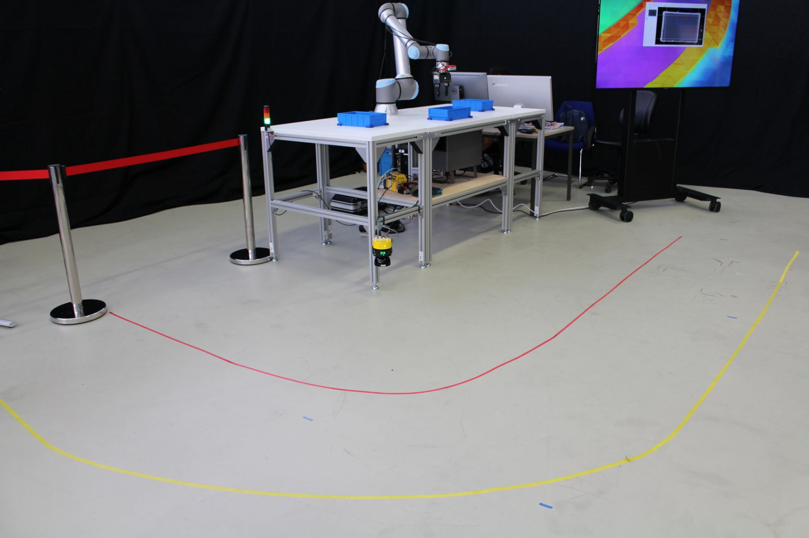
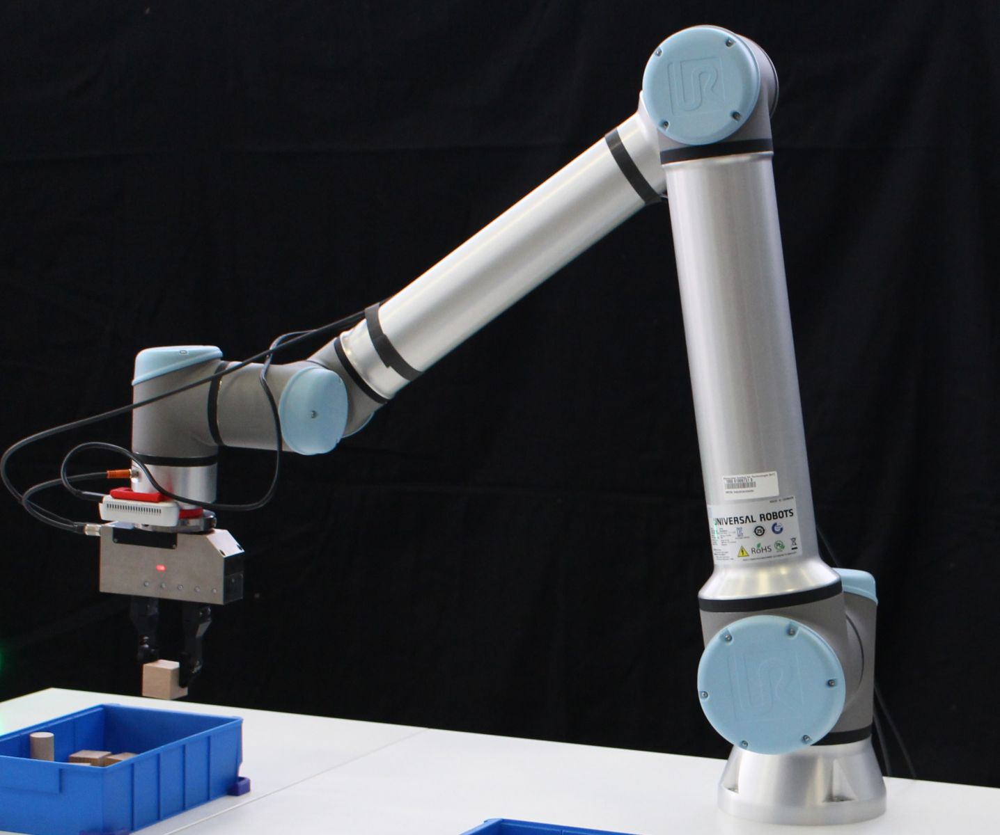
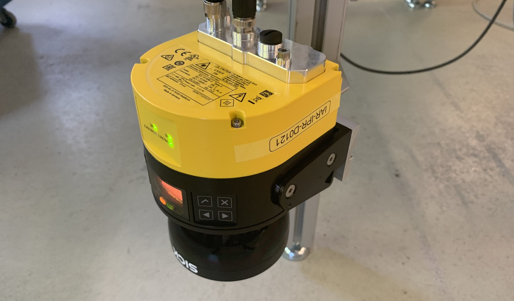
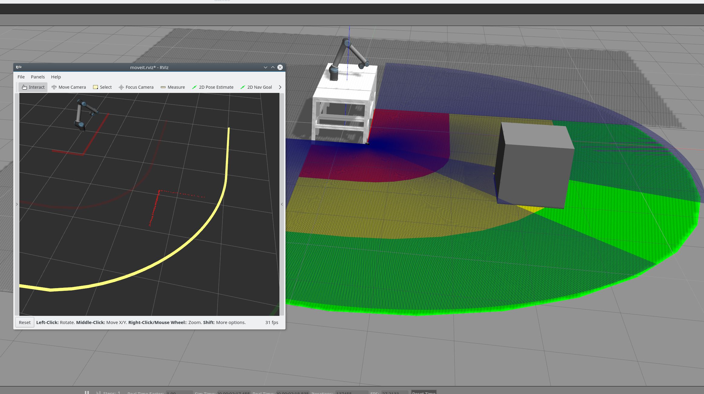

# RoboShield
This repository serves as the simulation environment of the RoboShield project. The whole RoboShield project are with three parts: Safety, Security and Privacy, and this repository focuses on the Safety part. 

The aim of the RoboShield project is therefore to enable manufacturers, system integrators and end-users of industrial automation technologies to adapt to rapidly changing market conditions while ensuring the safety of the production facility. For more specific information, please refer to the [**website**](https://www.roboshield-bw.de/).

## Setup

The simulation environment is a remapping of the real world setup, as shown in Picture blow. 

### Core Parts

#### Robot Arm

A UR10e lightweight robot is used as the robot which is specially designed for collaborative operation.

####  Laser Scanner

Environmental monitoring is carried out with a Sick MicroScan 3 pro laser scanner. The monitoring area of the scanner is divided into two areas. In the first area (between red line and yellow line in above picture) the robot speed is reduced, in the second area (between red line and the table above) the robot movement is stopped.

 

### Remapping to the Gazebo Simulation Environment 

The simulation setup contained in this repository remaps the real world to the Gazebo environment, with all necessary components included, e.g. Laser Scanner, Robot Arm. The remapping results could be shown as Picture blow.

