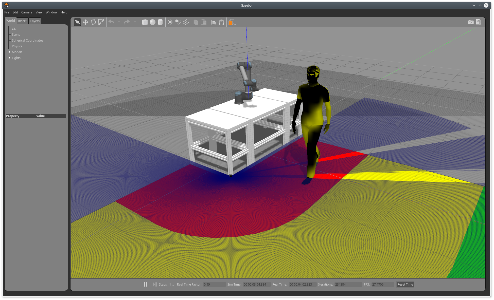

# RoboShield
This repository serves as the simulation environment of the RoboShield project. The whole RoboShield project are with three parts: Safety, Security and Privacy, and this repository focuses on the Safety part. 

The aim of the RoboShield project is therefore to enable manufacturers, system integrators and end-users of industrial automation technologies to adapt to rapidly changing market conditions while ensuring the safety of the production facility. For more specific information, please refer to the [**website**](https://www.roboshield-bw.de/).


## Setup

The simulation environment is a remapping of the real world setup, as shown in Picture blow, which contains three core components:
- **Robot Arm:** A UR10e lightweight robot is used as the robot which is specially designed for collaborative operation.
- **Laser Scanner:** Environmental monitoring is carried out with a Sick MicroScan 3 pro laser scanner. The monitoring area of the scanner is divided into two areas. In the first area (between red line and yellow line in above picture) the robot speed is reduced, in the second area (between red line and the table above) the robot movement is stopped.
- **Gripper**: Used for bin-picking work task.


### Remapping to the Gazebo Simulation Environment 

The simulation setup contained in this repository remaps the real world to the Gazebo environment, with all 
necessary components included, e.g. Laser Scanner, Robot Arm. The remapping results could be shown as Picture blow.


This repository offers two types of visualization:

- **Gazebo**. In the Gazebo environment, the robotics' motion is simulated or can display the robot's motion in the real-world
if the connection to the robot hardware is established. At the same time, Laser Scanner could also be simulated or just be the 
visualization of the scanner result.

- **Rviz**. When Gazebo runs, the rviz offers another option to visualize the detection result of the laser scanner. As shown in
the picture, the red dots represents for the detections of the object, which is inside the laser scanner's range. At the same
time, the bright red  curve indicates that the object was inside the red area.

## How to use

### How to install

```shell script
mkdir -p  ~/catkin_ws/src
cd ~/catkin_ws/src
git clone this_repo.git
cd ..
catkin build
```
Remember to add Universal_Robot_Package alongside the source file:
```shell script
git clone git@github.com:ros-industrial/universal_robot.git
```
Every time before you run the ros package, remember to source the bash
```shell script
source ~/catkin_ws/devel/setup.bash
```
Or you could just add it to your .bashrc file.

### How to run

#### Simulated Environment (without connection to the hardware) 

- if you would like to run the simulated Gazebo environment and the corresponding RVIZ:
```shell script
roslaunch robo_shield_pkg robo_shield_demonstrator_offline.launch
```

- If you would like to add some dynamic model (like human) into the gazebo: 
```shell script
roslaunch robo_shield_pkg human.launch
```
and then, you could see one human model was generated in the Gazebo environment, as shown in the
picture blow:


#### Pure Visualization (WIth Connection to the hardware)

Before starting the program, please check and modify the sensor ip in the **./sick_safetyscanners/launch/sick_safetyscanners.launch**
and change the host-ip (where do you start the program), which ensures you to have the connection with the laser:
```shell script
  <arg name="sensor_ip" default="141.3.80.xxx" />
  <arg name="host_ip" default="141.3.81.xxx" />
```


sda


sda


sd
s


s


s
ss